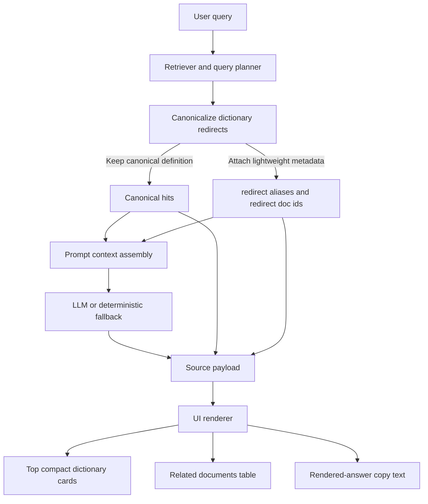

# Dictionary Answer Flow

This note tracks the dictionary answer layers so rendering fixes do not hide backend data-shaping issues.

Rules:

- Redirect-only entries such as `HEADWORD nh TARGET` are merged before prompt assembly when the target entry is also retrieved.
- The prompt keeps the canonical entry with the definition and only carries alias/ref labels as lightweight metadata.
- The source payload preserves redirect doc ids so citations to an alias can still open the canonical source.
- UI cards stay compact and should not implement semantic de-duplication as their primary responsibility.
